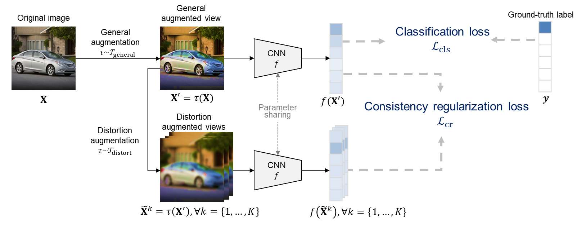

# Consistency Regularization for Distortion-Robust Image Classification in Industrial Machine Vision

Official implementation of the paper: **"Consistency regularization for distortion-robust image classification in industrial machine vision"**

**Authors:** Hyungu Kang, Seokho Kang  




## 📂 Directory Hierarchy
```text
CR_distortion/
├── README.md
├── run/
│   ├── run.py
│   ├── train.py
│   ├── utils.py
│   └── wideresnet.py
└── data/
    ├── preprocess.py
    ├── cifar-10-python.tar.gz
    ├── cifar-100-python.tar.gz
    ├── ...
    └── preprocess/
        ├── CIFAR10_X.npy
        ├── CIFAR10_y.npy
        └── ...
```

## 🛠 Requirements

| Library | Version |
| :--- | :--- |
| PyTorch | 2.5.1 |
| Torchvision | 0.20.1 |
| Scikit-learn | 1.8.0 |
| OpenCV | 4.13.0.92 |
| NumPy | 2.4.2 |
| Albumentations | 1.4.18 |
